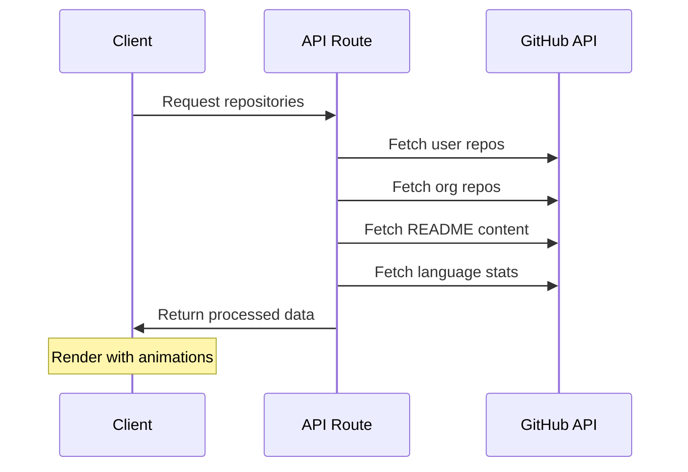

# 🚀 Modern Portfolio with GitHub Integration

A dynamic, responsive portfolio built with **Next.js 15**, **TypeScript**, and **Tailwind CSS** that automatically showcases your GitHub repositories with beautiful animations and interactive features.


## ✨ Features

### 🎯 Core Features
- **GitHub Integration**: Automatically fetches and displays your repositories
- **Organization Support**: Shows repositories from organizations you're part of
- **Interactive Terminal**: Built-in terminal with AI chat capabilities
- **Smooth Animations**: Custom scroll-based animations and transitions
- **Responsive Design**: Mobile-first approach with beautiful UI
- **Dark Theme**: Modern dark theme with consistent color palette

### 📊 Repository Showcase
- **README Rendering**: Full GitHub-flavored markdown with syntax highlighting
- **Mermaid Diagrams**: Supports Mermaid diagrams in README files
- **Tech Stack Visualization**: Language breakdown with progress bars
- **Organization Badges**: Visual indicators for organization repositories
- **Live Links**: Direct links to GitHub repositories

### 🤖 AI Terminal
- **Gemini Integration**: AI-powered chat assistance
- **Command System**: Unix-like command interface
- **Contact Form**: Integrated email functionality
- **Interactive Experience**: Engaging terminal simulation

## 🏗️ Architecture

```mermaid
graph TB
    A[Next.js App Router] --> B[Server Components]
    A --> C[Client Components]
    
    B --> D[API Routes]
    D --> E[GitHub API]
    D --> F[Email Service]
    
    C --> G[Terminal Engine]
    C --> H[Scroll Animations]
    C --> I[Project Showcase]
    
    E --> J[Repository Data]
    E --> K[README Content]
    E --> L[Language Stats]
    
    F --> M[Contact Form]
    G --> N[AI Chat (Gemini)]
    
    style A fill:#0070f3
    style E fill:#24292e
    style N fill:#4285f4
```

## 🚀 Quick Start

### Prerequisites
- Node.js 18+ 
- npm/yarn/pnpm

### Installation

1. **Clone the repository**
   ```bash
   git clone https://github.com/rudra-sah00/portfolio.git
   cd portfolio
   ```

2. **Install dependencies**
   ```bash
   npm install
   ```

3. **Configure GitHub Username**
   Update the username in `src/components/ProjectsSection.tsx`:
   ```typescript
   const username = 'your-github-username';
   ```

4. **Start Development Server**
   ```bash
   npm run dev
   ```

5. **Open in Browser**
   Navigate to [http://localhost:3000](http://localhost:3000)

## 📁 Project Structure

```
portfolio/
├── src/
│   ├── app/                    # Next.js App Router
│   │   ├── api/               # API routes
│   │   │   ├── contact/       # Email functionality
│   │   │   └── repositories/  # GitHub API integration
│   │   ├── globals.css        # Global styles
│   │   ├── layout.tsx         # Root layout
│   │   └── page.tsx          # Home page
│   ├── components/            # React components
│   │   ├── projects/         # Project showcase components
│   │   │   ├── ProjectInfo.tsx
│   │   │   ├── ReadmeViewer.tsx
│   │   │   ├── TechStack.tsx
│   │   │   └── *.module.css
│   │   ├── ui/               # Reusable UI components
│   │   ├── Hero.tsx          # Hero section
│   │   ├── ProjectsSection.tsx
│   │   ├── TerminalPopup.tsx
│   │   └── Footer.tsx
│   ├── lib/                  # Utilities and services
│   │   ├── api/             # API clients
│   │   ├── terminal/        # Terminal engine
│   │   └── utils.ts
│   ├── types/               # TypeScript definitions
│   └── hooks/               # Custom React hooks
├── public/                  # Static assets
├── .env.local              # Environment variables
└── package.json           # Dependencies
```

## 🔧 Configuration

### GitHub Token Setup

The portfolio comes with a pre-configured GitHub token for fetching repository data. If you need to use your own token, update it in:
- `src/app/api/repositories/route.ts` (line 23)

### AI Chat Integration

The Gemini AI chat feature is pre-configured and ready to use.

### Email Service

Contact form emails are configured to work out of the box.

## 🎨 Customization

### Styling
- **CSS Variables**: Located in `src/app/globals.css`
- **Component Styles**: Individual `.module.css` files
- **Responsive Design**: Mobile-first approach with breakpoints

### GitHub Integration
- **Username**: Update in `ProjectsSection.tsx`
- **Repository Filtering**: Modify API route logic
- **README Rendering**: Customize in `ReadmeViewer.tsx`

### Terminal Commands
- **Add Commands**: Extend `src/lib/terminal/commands/index.ts`
- **AI Integration**: Configure in `src/lib/terminal/chat/`

## 📊 Features in Detail

### Repository Showcase


### Tech Stack Visualization
- Language percentage calculation
- Color-coded progress bars
- Responsive layout

### Organization Support
- Automatic detection of organization repositories
- Visual badges with organization names
- Separate filtering and display logic

## 🚀 Deployment

### Vercel (Recommended)

1. **Connect Repository**
   ```bash
   vercel --prod
   ```

2. **Deploy**
   The application will deploy automatically without any environment variable configuration needed.

3. **Domain Setup**
   Configure custom domain in Vercel settings

### Other Platforms

Build the project:
```bash
npm run build
```

The output will be in the `.next` folder, ready for deployment.

## 🧪 Testing

```bash
# Type checking
npm run type-check

# Linting
npm run lint

# Build verification
npm run build
```

## 🔒 API Configuration

All API keys are pre-configured in the application:

| Service | Status | Location |
|---------|--------|----------|
| GitHub API | ✅ Configured | `src/app/api/repositories/route.ts` |
| Gemini AI | ✅ Configured | `src/lib/terminal/chat/gemini.ts` |
| Email Service | ✅ Configured | `src/app/api/contact/route.ts` |

**Note**: API keys are hardcoded for easy deployment. For production use with sensitive data, consider using environment variables.

## 🤝 Contributing

1. Fork the repository
2. Create a feature branch (`git checkout -b feature/amazing-feature`)
3. Commit changes (`git commit -m 'Add amazing feature'`)
4. Push to branch (`git push origin feature/amazing-feature`)
5. Open a Pull Request

## 📝 License

This project is licensed under the MIT License - see the [LICENSE](LICENSE) file for details.

## 🙏 Acknowledgments

- [Next.js](https://nextjs.org/) - React framework
- [GitHub API](https://docs.github.com/en/rest) - Repository data
- [Google Gemini](https://ai.google.dev/) - AI chat capabilities
- [Mermaid](https://mermaid.js.org/) - Diagram rendering
- [Resend](https://resend.com/) - Email service

## 📞 Support

If you have any questions or need help:

- 📧 Email: [your-email@example.com](mailto:your-email@example.com)
- 🐛 Issues: [GitHub Issues](https://github.com/rudra-sah00/portfolio/issues)
- 💬 Discussions: [GitHub Discussions](https://github.com/rudra-sah00/portfolio/discussions)

---

**Made with ❤️ using Next.js and TypeScript**
