# 🚀 Modern Portfolio with Advanced Animations & GitHub Integration

A cutting-edge, responsive portfolio built with **Next.js 15**, **TypeScript**, **GSAP animations**, and **Tailwind CSS** that automatically showcases your GitHub repositories with stunning animations and interactive features.

🌐 **Live Website**: [rudrasahoo.live](https://rudrasahoo.live)


[](https://github.com/rudra-sah00/Portfolio/actions)
[](https://codecov.io/gh/rudra-sah00/Portfolio)


## ✨ Features

### 🎯 Core Features

- **GitHub Integration**: Automatically fetches and displays your repositories with real-time data
- **Organization Support**: Shows repositories from organizations you're part of with custom badges
- **Interactive Terminal**: Built-in terminal with AI chat capabilities powered by Google Gemini
- **GSAP Animations**: Professional-grade animations with scroll triggers and smooth transitions
- **Smooth Scrolling**: Buttery smooth page transitions and element animations
- **Responsive Design**: Mobile-first approach with pixel-perfect responsive layouts
- **Dark Theme**: Modern dark theme with consistent color palette and accessibility features
- **Performance Optimized**: Built with Next.js 15 App Router and optimized for speed

### 🎨 Animation Features

- **GSAP Timeline Animations**: Complex animation sequences with precise timing
- **Scroll-Triggered Animations**: Elements animate as they enter the viewport
- **Floating Dock**: Smooth hover animations for social media links
- **Text Flip Animations**: Eye-catching text reveal animations
- **Sparkle Effects**: Interactive sparkle animations on hover
- **Container Parallax**: Smooth parallax scrolling effects
- **Stagger Animations**: Coordinated animations across multiple elements

### 📊 Repository Showcase

- **README Rendering**: Full GitHub-flavored markdown with syntax highlighting
- **Mermaid Diagrams**: Supports complex Mermaid diagrams in README files
- **Tech Stack Visualization**: Interactive language breakdown with animated progress bars
- **Organization Badges**: Clean visual indicators for organization repositories
- **Live Links**: Direct links to GitHub repositories and live demos
- **Repository Filtering**: Smart filtering and categorization of projects
- **Real-time Data**: Fresh repository data fetched from GitHub API

### 🤖 AI Terminal Experience

- **Gemini Integration**: Advanced AI-powered chat assistance with context awareness
- **Command System**: Full Unix-like command interface with autocomplete
- **Contact Form**: Integrated email functionality with form validation
- **Interactive Shell**: Realistic terminal simulation with command history
- **Custom Commands**: Extensible command system for portfolio navigation
- **Chat Mode**: Seamless transition between command and chat modes

### 🎯 Advanced Customizations

- **Vercel Analytics**: Real-time website analytics and performance monitoring
- **Speed Insights**: Page performance tracking and optimization
- **Custom CSS Variables**: Consistent theming system across all components
- **Modular Architecture**: Clean, maintainable component structure
- **TypeScript**: Full type safety and enhanced developer experience
- **SEO Optimized**: Meta tags, Open Graph, and structured data

## 🏗️ Technical Architecture

Built with modern web technologies and best practices:


## 🔄 CI/CD Workflow

Automated testing, building, and deployment pipeline powered by GitHub Actions:

```mermaid
graph TB
    Start([Push/PR Event]) --> Draft{Is PR Draft?}
    Draft -->|Yes| Skip[Skip Workflow ⏭️]
    Draft -->|No| Lint[Lint & Type Check 🔍]

    Lint --> ESLint[ESLint Check]
    Lint --> Prettier[Prettier Check]
    Lint --> TypeCheck[TypeScript Check]

    ESLint --> LintPass{All Pass?}
    Prettier --> LintPass
    TypeCheck --> LintPass

    LintPass -->|No| LintFail[❌ Workflow Failed]
    LintPass -->|Yes| Test[Test & Coverage 🧪]

    Test --> RunTests[npm run test:coverage]
    RunTests --> Coverage{Coverage Check}

    Coverage --> Codecov[Upload to Codecov 📊]
    Coverage --> Artifact1[Upload Coverage Reports]
    Coverage --> PRComment[Comment PR with Results 💬]

    Codecov --> CovThreshold{Meets Thresholds?}
    CovThreshold -->|Statements ≥ 80%| Build
    CovThreshold -->|Branches ≥ 70%| Build
    CovThreshold -->|Functions ≥ 68%| Build
    CovThreshold -->|Lines ≥ 80%| Build
    CovThreshold -->|No| Warning[⚠️ Coverage Warning]

    Warning --> Build[Build Application 🏗️]
    Build --> InstallDeps[npm ci]
    InstallDeps --> NextBuild[npm run build]
    NextBuild --> Artifact2[Upload Build Artifacts]

    Artifact2 --> BuildPass{Build Success?}
    BuildPass -->|No| BuildFail[❌ Build Failed]
    BuildPass -->|Yes| Security[Security Audit 🔒]

    Security --> NPMAudit[npm audit]
    Security --> Outdated[Check Outdated Packages]

    NPMAudit --> SecurityPass{Security OK?}
    Outdated --> SecurityPass

    SecurityPass -->|Yes| PRCheck{Is PR?}
    SecurityPass -->|No| SecurityWarn[⚠️ Security Issues Found]
    SecurityWarn --> PRCheck

    PRCheck -->|Yes| PRStatus[PR Status Check ✅]
    PRCheck -->|No| Deploy

    PRStatus --> PRSuccess[All Checks Passed! 🎉]
    PRSuccess --> ReadyMerge[Ready to Merge]

    Deploy[Deploy to Production 🚀] --> Vercel[Vercel Deployment]
    Vercel --> VercelBuild[Build on Vercel]
    VercelBuild --> VercelDeploy[Deploy to Edge Network]
    VercelDeploy --> Live[✅ Live at rudrasahoo.live]

    Live --> Analytics[Vercel Analytics 📈]
    Live --> SpeedInsights[Speed Insights ⚡]

    style Start fill:#4CAF50
    style Skip fill:#9E9E9E
    style LintFail fill:#f44336
    style BuildFail fill:#f44336
    style Warning fill:#FF9800
    style SecurityWarn fill:#FF9800
    style Live fill:#4CAF50
    style Codecov fill:#F01F7A
    style Vercel fill:#000000
    style PRSuccess fill:#4CAF50
    style ReadyMerge fill:#2196F3
```



### Workflow Details

#### 🔍 Lint & Type Check

- **ESLint**: Code quality and style enforcement
- **Prettier**: Code formatting validation
- **TypeScript**: Type safety verification
- **Node Version**: 20.x with npm cache

#### 🧪 Test & Coverage

- **Test Runner**: Jest with React Testing Library
- **Coverage Thresholds**:
  - Statements: ≥ 80%
  - Branches: ≥ 70%
  - Functions: ≥ 68%
  - Lines: ≥ 80%
- **Coverage Tools**: Codecov integration with PR comments
- **Test Count**: 278 comprehensive tests across 19 suites

#### 🏗️ Build Process

- **Framework**: Next.js 15 with App Router
- **Output**: Optimized static and server bundles
- **Artifacts**: Build output uploaded for deployment
- **Environment**: Production-ready configuration

#### 🔒 Security Audit

- **npm audit**: Vulnerability scanning
- **Dependency Check**: Outdated package detection
- **Severity Level**: Moderate and above
- **Auto-remediation**: Continuous monitoring

#### 🚀 Deployment

- **Platform**: Vercel Edge Network
- **Trigger**: Automatic on main branch push
- **Preview**: PR preview deployments
- **Analytics**: Real-time monitoring
- **Performance**: Speed Insights tracking

#### 📊 PR Validation

- **Status Checks**: All jobs must pass
- **Coverage Reports**: Automatic PR comments
- **Build Verification**: Ensures production readiness
- **Merge Protection**: Enforced via branch rules

### 🛠️ Tech Stack

- **Frontend**: Next.js 15, React 18, TypeScript 5
- **Styling**: Tailwind CSS, CSS Modules, Custom CSS Variables
- **Animations**: GSAP 3, Framer Motion, CSS Transitions
- **APIs**: GitHub REST API, Google Gemini AI, Resend Email
- **Deployment**: Vercel with Edge Functions
- **Analytics**: Vercel Analytics & Speed Insights
- **Performance**: Image optimization, Code splitting, Edge caching

## 🚀 Quick Start

### Prerequisites

- Node.js 18+
- npm/yarn/pnpm

### Installation

1. **Clone the repository**

   ```bash
   git clone https://github.com/rudra-sah00/portfolio.git
   cd portfolio
   ```

2. **Install dependencies**

   ```bash
   npm install
   ```

3. **Configure Environment Variables**

   Create a `.env.local` file in the root directory:

   ```bash
   cp .env.local.example .env.local
   ```

   Then add your tokens:

   ```env
   # Required: GitHub Personal Access Token
   # Get from: https://github.com/settings/tokens
   # Scopes: repo, read:org
   GITHUB_TOKEN=your_github_pat_here

   # Optional: Email configuration for contact form
   EMAIL_USER=your-email@gmail.com
   EMAIL_PASS=your-app-password
   EMAIL_TO=recipient@email.com

   # Optional: Gemini AI for terminal chat
   GEMINI_API_KEY=your_gemini_api_key

   # Site URL
   NEXT_PUBLIC_SITE_URL=https://rudrasahoo.live
   ```

4. **Configure GitHub Username**
   Update the username in `src/components/ProjectsSection.tsx`:

   ```typescript
   const username = "your-github-username";
   ```

5. **Start Development Server**

   ```bash
   npm run dev
   ```

6. **Open in Browser**
   Navigate to [http://localhost:3000](http://localhost:3000)

## 📁 Project Structure

```
portfolio/
├── src/
│   ├── app/                    # Next.js App Router
│   │   ├── api/               # API routes
│   │   │   ├── contact/       # Email functionality
│   │   │   └── repositories/  # GitHub API integration
│   │   ├── globals.css        # Global styles
│   │   ├── layout.tsx         # Root layout
│   │   └── page.tsx          # Home page
│   ├── components/            # React components
│   │   ├── projects/         # Project showcase components
│   │   │   ├── ProjectInfo.tsx
│   │   │   ├── ReadmeViewer.tsx
│   │   │   ├── TechStack.tsx
│   │   │   └── *.module.css
│   │   ├── ui/               # Reusable UI components
│   │   ├── Hero.tsx          # Hero section
│   │   ├── ProjectsSection.tsx
│   │   ├── TerminalPopup.tsx
│   │   └── Footer.tsx
│   ├── lib/                  # Utilities and services
│   │   ├── api/             # API clients
│   │   ├── terminal/        # Terminal engine
│   │   └── utils.ts
│   ├── types/               # TypeScript definitions
│   └── hooks/               # Custom React hooks
├── public/                  # Static assets
├── .env.local              # Environment variables
└── package.json           # Dependencies
```

## 🔧 Configuration

### GitHub Token Setup

The portfolio comes with a pre-configured GitHub token for fetching repository data. If you need to use your own token, update it in:

- `src/app/api/repositories/route.ts` (line 23)

### AI Chat Integration

The Gemini AI chat feature is pre-configured and ready to use.

### Email Service

Contact form emails are configured to work out of the box.

## 🎨 Customization

### Styling

- **CSS Variables**: Located in `src/app/globals.css`
- **Component Styles**: Individual `.module.css` files
- **Responsive Design**: Mobile-first approach with breakpoints

### GitHub Integration

- **Username**: Update in `ProjectsSection.tsx`
- **Repository Filtering**: Modify API route logic
- **README Rendering**: Customize in `ReadmeViewer.tsx`

### Terminal Commands

- **Add Commands**: Extend `src/lib/terminal/commands/index.ts`
- **AI Integration**: Configure in `src/lib/terminal/chat/`

## 📊 Features in Detail

### Repository Showcase


### Tech Stack Visualization

- Language percentage calculation
- Color-coded progress bars
- Responsive layout

### Organization Support

- Automatic detection of organization repositories
- Visual badges with organization names
- Separate filtering and display logic

## 🚀 Deployment

### Vercel (Recommended)

1. **Connect Repository**

   ```bash
   vercel --prod
   ```

2. **Deploy**
   The application will deploy automatically without any environment variable configuration needed.

3. **Domain Setup**
   Configure custom domain in Vercel settings

### Other Platforms

Build the project:

```bash
npm run build
```

The output will be in the `.next` folder, ready for deployment.

## 🧪 Testing

```bash
# Type checking
npm run type-check

# Linting
npm run lint

# Build verification
npm run build
```

## 🔒 API Configuration

All API keys are pre-configured in the application:

| Service       | Status        | Location                            |
| ------------- | ------------- | ----------------------------------- |
| GitHub API    | ✅ Configured | `src/app/api/repositories/route.ts` |
| Gemini AI     | ✅ Configured | `src/lib/terminal/chat/gemini.ts`   |
| Email Service | ✅ Configured | `src/app/api/contact/route.ts`      |

**Note**: API keys are hardcoded for easy deployment. For production use with sensitive data, consider using environment variables.

## 🤝 Contributing

1. Fork the repository
2. Create a feature branch (`git checkout -b feature/amazing-feature`)
3. Commit changes (`git commit -m 'Add amazing feature'`)
4. Push to branch (`git push origin feature/amazing-feature`)
5. Open a Pull Request

## 📝 License

This project is licensed under the MIT License - see the [LICENSE](LICENSE) file for details.

## 🙏 Acknowledgments

- [Next.js](https://nextjs.org/) - React framework
- [GitHub API](https://docs.github.com/en/rest) - Repository data
- [Google Gemini](https://ai.google.dev/) - AI chat capabilities
- [Mermaid](https://mermaid.js.org/) - Diagram rendering
- [Resend](https://resend.com/) - Email service

## 📞 Contact & Links

- 🌐 **Live Website**: [rudrasahoo.live](https://rudrasahoo.live)
- 📧 **Email**: [rudranarayanaknr@gmail.com](mailto:rudranarayanaknr@gmail.com)
- 💼 **LinkedIn**: [Rudra Sahoo](linkedin.com/in/rudra-narayana-sahoo-695342288)
- 🐙 **GitHub**: [@rudra-sah00](https://github.com/rudra-sah00)
- 📷 **Instagram**: [@rudra_sah_00](https://instagram.com/rudra.sah00)
- 🐛 **Issues**: [GitHub Issues](https://github.com/rudra-sah00/portfolio/issues)
- 💬 **Discussions**: [GitHub Discussions](https://github.com/rudra-sah00/portfolio/discussions)

---

**Made with ❤️ using Next.js 15, TypeScript, GSAP & Modern Web Technologies**

🚀 **Live at**: [rudrasahoo.live](https://rudrasahoo.live)
